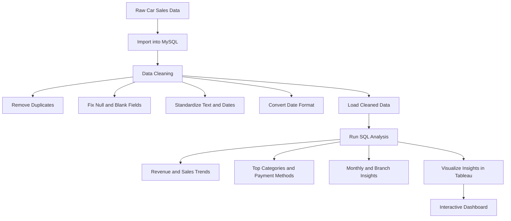

# 🚗 Car Sales Data Cleaning, SQL Analysis & Tableau Dashboard

This project focuses on cleaning and analyzing car sales data from 2022 to 2023 using **MySQL** and visualizing key business insights in a **Tableau dashboard**. After detecting and fixing data quality issues like duplicates, missing values, and inconsistent fields, the cleaned dataset was loaded into MySQL. SQL queries were used to explore trends, top-performing car models, and calculate key performance metrics like CYTD and PYTD sales with year-over-year growth. Tableau was then used to build an interactive dashboard highlighting these metrics for better business insights.

---

## 📊 Project Overview

### 🧼 Data Cleaning & Preparation
- Imported raw data into **MySQL**
- Removed duplicates, handled nulls, and standardized formats using SQL

### 🧠 SQL Analysis
- Performed analysis on:
  - Payment methods & transaction counts
  - Highest-rated categories per branch
  - Busiest sales days and monthly trends
  - Year-over-year sales and revenue trends

### 📈 Tableau Dashboard
- Interactive dashboard includes:
  - CYTD vs. PYTD Sales
  - YoY Sales Growth
  - Sales by Company
  - Monthly Car Sales
  - Body Type & Model Price breakdowns

---

## 🧰 Technologies Used

- **MySQL** – for data cleaning and analysis  
- **Tableau** – for building the dashboard

---
### 🔄 Car Sales Data Project Workflow




---

## 🧮 SQL Analysis Examples

### 💳 Payment Methods & Transactions
```sql
SELECT payment_method, COUNT(*) AS no_payments, SUM(quantity) AS no_qty_sold
FROM car_sales
GROUP BY payment_method;
```

### ⭐ Highest-Rated Category per Branch
```sql
SELECT branch, category, AVG(rating) AS avg_rating
FROM car_sales
GROUP BY branch, category
ORDER BY branch, avg_rating DESC;
```

### 📅 Busiest Day per Branch
```sql
SELECT branch, DATE_FORMAT(STR_TO_DATE(date, '%d/%m/%y'), '%W') AS day_name, COUNT(*) AS no_transactions
FROM car_sales
GROUP BY branch, day_name
ORDER BY branch, no_transactions DESC;
```

### 📉 Year-over-Year Revenue Decline
```sql
WITH revenue_2022 AS (
  SELECT branch, SUM(total) AS revenue
  FROM car_sales
  WHERE EXTRACT(YEAR FROM STR_TO_DATE(date, '%d/%m/%y')) = 2022
  GROUP BY branch
),
revenue_2023 AS (
  SELECT branch, SUM(total) AS revenue
  FROM car_sales
  WHERE EXTRACT(YEAR FROM STR_TO_DATE(date, '%d/%m/%y')) = 2023
  GROUP BY branch
)
SELECT 
  r2.branch,
  r2.revenue AS last_year_revenue,
  r3.revenue AS current_year_revenue,
  ROUND((r2.revenue - r3.revenue) / r2.revenue * 100, 2) AS revenue_difference_percentage
FROM revenue_2022 r2
JOIN revenue_2023 r3 ON r2.branch = r3.branch
WHERE r2.revenue > r3.revenue
ORDER BY revenue_difference_percentage DESC;
```

---

## 📊 Tableau Dashboard


### Dashboard Highlights
- **CYTD vs. PYTD Total Sales**
- **Monthly Sales Trend**
- **Top Companies by Revenue**
- **Car Body Type Performance**
- **Model Price Distribution**

---

## 📂 Acknowledgments

- Dataset source: [Kaggle - Car Sales Report](https://www.kaggle.com/datasets/missionjee/car-sales-report)
- Tableau Dashboard: [Dashboard - Car Sales](https://github.com/kChe626/Car_Sales/blob/main/Car%20Sale(tableu).twbx)
- Cleaned Data: [Car Sales Cleaned Data text](https://github.com/kChe626/Car_Sales/blob/main/Car_Sales%20Data%20Cleaning.txt)
